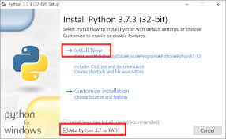

# 2022.07.05 교육

- ## GIT/GITHUB란?

> ### **프로젝트 버전관리 == 분산 버전 관리 시스템==형상관리 도구**

- ## markdown란?


> ### 텍스트 기반의 마크업언어 ex) HTML,CSS,JS

- ### 주피터 노트북은 별도의 마크다운 셀이 있고, 노션과 같은 노트필기 sw에서도 기본 문법으로 쓰인다.

- ### Typora 가 하나의 마크다운 편집기임

- #### #띄워쓰기는 h1~6까지 활용이 가능하고, #이 늘어날수록 글씨의 크기는 줄어드나 글씨 크기를 키우는데 사용되지는 않는다.


## 목록

- ### 순서가 없는 목록(LIST)[UL]

  > ### -(hypen), *(asterisk)를 사용하며, TAB과 쉬프트+TAB으로 조절한다.

- ## 순서가 있는 목록(LIST)[OL]

  > ### 1,2와 같은 숫자를 사용하며, TAB으로 조절한다.


## 코드 블록(code block)

- ## fenced code block

  - ### backtick 기호 3개를 활용하여 작성한다. ex) ```

  - ### 특정언어를 명시하면 syntax Highlighting 기능이 적용된다. ex) python, HTML등등

  - ### 특정 소프트웨어에서 복붙해서 넣을수도 있다.

```python
print('hello')

if true:
    print('t')
else:
    print('f')
#주석
```

``` html
print ('hello')
# 주석?
<h1>
    제목
</h1>
<!-- 주석 -->
```

- ## Inline code block

  - ### ``를 통해 코드를 넣을수 있다.

  - ### `print` 로 표현할수있다.

## 링크

- ### [문자열] (url)을 통해 링크를 작성 가능

  - ### [실라버스 링크](https://syllaverse.com/courses/4)


## 이미지

- ### ![문자열] (url)을 통해 이미지를 넣을수 있다.

  - ### 절대 경로

  - ### C:/HPHK/Desktop/TIL/untitle.png



- ## 아래의 이미지로 나옴

  - ### 상대 경로
  
  -  ### ./md-images/untitle.png
  
  - ### 마크다운 assets 폴더를 같이 공유하면,


## 인용문

> ### '>' 를 통해 넣을 수 있음


## 표

> ### 본문 > 표 > 삽입 (cirl+t)

- #### 타이포라 기능을 적극 활용하자

|이름 |  댓글  |
|----|   ----|
| 엄복X | **정말 잘 보고 있습니다!** |
|류진X| **실례가 안된다면 100만원만 주십시요** |
|이성X| **어쩔티비!** |

## Text 강조

-  ### **굵게**(본드체) :  **

- ### *기울임* : *

- ### ***기울임*** : ***

- ### ~~취소선~~

## 수평선

`---`

---

## CLI

- ### 프롬프트 기본 인터페이스

  - ### 컴퓨터 정보
  - ### 디렉터리
  - ### $

## 이모티콘

- ### window + .

## Git 단축키

- ### pwd : 현재 디렉토리 출력

- ### cd 디렉토리이름 : 디렉토리 이동

- ### . : 현재 디렉토리

- ### .. : 상위 디렉토리

- ### ls (list) : 목록

- ### mkdir (make directory) : 디렉토리 생성

- ### touch : 파일 생성

- ### rm 파일명: 파일 삭제하기

- ### rm –r 폴더명 : 폴더 삭제하기

# Git Status

## a.txt 파일을 만든 직후

> 빨간 글씨 => 1통

~~~bash
$ git status
On branch master

# 트래킹이 되고 있지 않은 파일?
# => 1통 (working directory)
# => 한번도 git으로 관리되고 있지 않은 파일!
Untracked files:
# git add 사용해봐...
# 포함시키기 위해서 / 커밋이 될 것 => 2통에 넣으려면
  (use "git add <file>..." to include in what will be committed)
        a.txt

# 커밋할 것은 없어 => 2통이 비어있어
# 하지만(but) 트래킹되지 않은 파일은 존재한다. 
# (git add 사용해서 트래킹해)
nothing added to commit but untracked files present (use "git add" to track)
~~~

##  b.txt 파일을 만들고 add한 이후

> 초록 글씨 => 2통

``` bash
$ git status
On branch master
# (커밋될) 변경사항들 => 2통
Changes to be committed:
  (use "git restore --staged <file>..." to unstage)
  		# 새로운 파일: b.txt
        new file:   b.txt

Untracked files:
  (use "git add <file>..." to include in what will be committed)
        a.txt

```


# a.txt 파일과 b.txt 파일을 모두 add한 이후 커밋까지

``` bash
$ git status
On branch master
# 2통, 1통 모두 클린~!
nothing to commit, working tree clean
```

- ### 저장소 처음 만들때 

  - ### $ git init 

- ### 버전을 기록할 때 

  - ### $ git add . 

  - ### $ git commit -m '커밋메시지' 

- ### 상태 확인할 때 

  - ### $ git status : 1통, 2통(버전확인용)

  - ###  $ git log : 커밋 확인

## 사용자 정보

- ### git config - global user.name "username"

  - #### Github에서 설정한 username "username"

- ### git config - global user.email "my@email.com"

  - #### Github에서 설정한 email로 설정

## 설정 확인

- ### git config -l

- ### git config --global -l

- ### git config user.name
