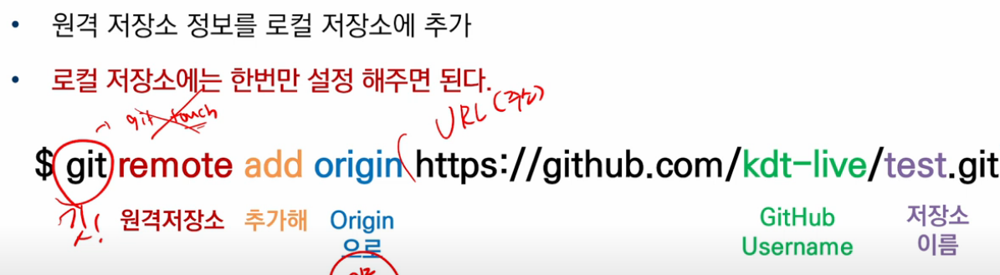

# 2022.07.06 교육

## GitHub도 버전(커밋)을 관리한다.

## 원격저장소 경로 설정

```
echo "# molla" >> README.md
git init
git add README.md
git commit -m "first commit"
git branch -M master
git remote add origin https://github.com/jugosu/molla.git
git push -u origin master
```



## =>깃아 원격저장소 추가해 '줘' 오리진이라는 이름으로 url을

## 원격저장소 활용 명령어 - push

- ### $ git push <원격저장소이름><브랜치이름>

  - ### push할 때는 인증 정보가 필수적입니다.